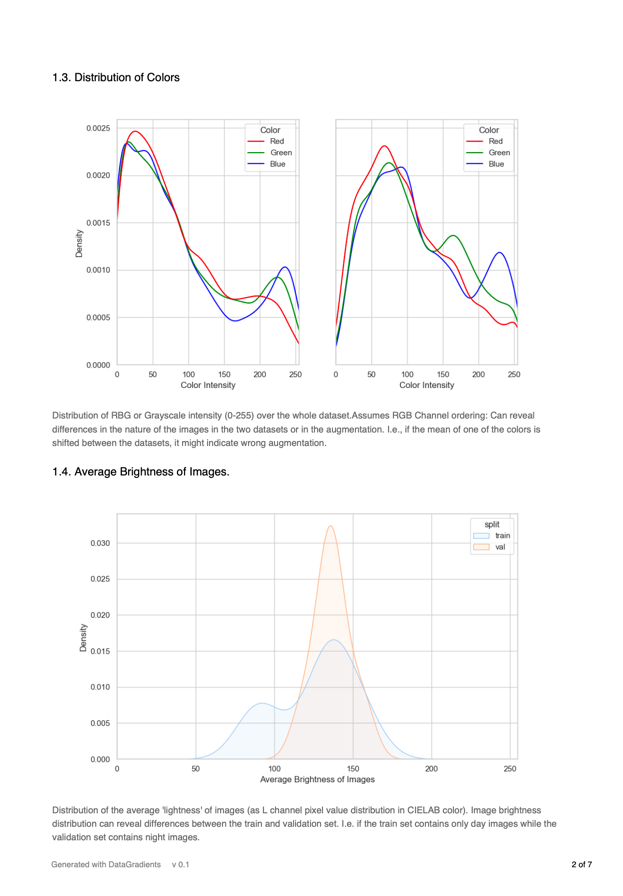
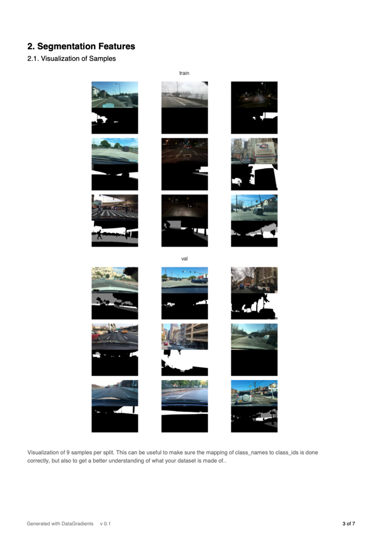
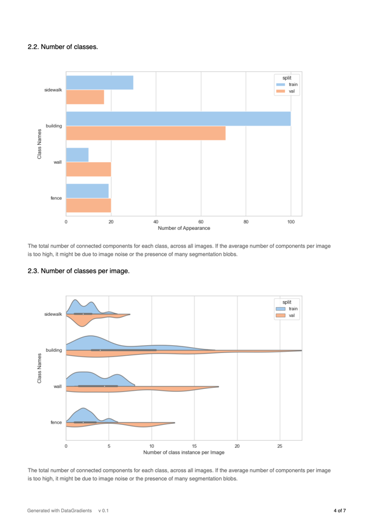

# DataGradients
<div align="center">
<p align="center">
  <a href="https://github.com/Deci-AI/super-gradients#prerequisites"></a>
  <a href="https://pypi.org/project/data-gradients/"></a>
  <a href="https://github.com/Deci-AI/data-gradients/releases"></a>
  <a href="https://github.com/Deci-AI/data-gradients/blob/master/LICENSE.md"></a>
</p>   
</div>

DataGradients is an open-source python based library specifically designed for computer vision dataset analysis. 

It automatically extracts features from your datasets and combines them all into a single user-friendly report. 

## Features
- Image-Level Evaluation: DataGradients evaluates key image features such as resolution, color distribution, and average brightness.
- Class Distribution: The library extracts stats allowing to know which classes are the most used, how many objects do you have per image, how many image without any label, ...
- Heatmap Generation: DataGradients produces heatmaps of bounding boxes or masks allowing you to understand if the objects are positioned in the right area.
- And many more!

<div align="center">
  
  
  
  <p><em>Example of pages from the Report</em>
</div>

## Installation
You can install DataGradients directly from the Github repository.

```
pip install git+https://github.com/Deci-AI/data-gradients
```


## Quick Start

### Prepare your Data
First, prepare your `train_data` and `val_data`.
This can be a pytorch dataset, dataloader or any type of data iterable.

**Example**
``` python
from torchvision.datasets import CocoDetection

train_data = CocoDetection(...)
```

**Good to know:**
DataGradients will try to find out how the dataset returns images and labels.
- If something cannot be automatically determined, you will be asked to provide some extra information through a text input.
- In some extreme cases, the process will crash and invite you to implement a custom dataset adapter (see relevant section)


### Object Detection Analyzer
```python
from data_gradients.managers.detection_manager import DetectionAnalysisManager

train_loader = ...
val_loader = ...
class_names = ...

analyzer = DetectionAnalysisManager(
    report_title="Testing Data-Gradients",
    train_data=train_loader,
    val_data=val_loader,
    class_names=class_names,
)

analyzer.run()
```

### Segmentation Analyzer
```python
from data_gradients.managers.segmentation_manager import SegmentationAnalysisManager 

train_loader = ...
val_loader = ...
class_names = ...

analyzer = SegmentationAnalysisManager(
    report_title="Testing Data-Gradients",
    train_data=train_loader,
    val_data=val_loader,
    class_names=class_names,
)

analyzer.run()
```

### Example
If you want to test it without having to download any datasets, you can check the following [segmentation example](https://github.com/Deci-AI/data-gradients/blob/master/examples/segmentation_example.py)


### Report
Once the analysis is done, the path to your pdf report will be printed.


## Dataset Adapters
Before implementing a Dataset Adapter try running without it, in many cases DataGradient will support your dataset without any code.

Two type of Dataset Adapters are available: `images_extractor` and `labels_extractor`. These functions should be passed to the main Analyzer function init.

```python
from data_gradients.managers.segmentation_manager import SegmentationAnalysisManager

train_data = ...
val_data = ...

# Let Assume that in this case, the  train_data and val_data return data in this format:
# (image, {"masks", "bboxes"})
images_extractor = lambda data: data[0]             # Extract the image
labels_extractor = lambda data: data[1]['masks']    # Extract the masks

# In case of segmentation. 
SegmentationAnalysisManager(
    report_title="Test with Adapters",
    train_data=train_data,
    val_data=val_data,
    images_extractor=images_extractor, 
    labels_extractor=labels_extractor, 
)

# For Detection, just change the Manager and the label_extractor definition.
```

### Image Adapter
Image Adapter functions should respect the following:

`images_extractor(data: Any) -> torch.Tensor`

- `data` being the output of the dataset/dataloader that you provided.
- The function should return a Tensor representing your image(s). One of:
  - `(BS, C, H, W)`, `(BS, H, W, C)`, `(BS, H, W)` for batch
  - `(C, H, W)`, `(H, W, C)`, `(H, W)` for single image
    - With `C`: number of channels (3 for RGB)


### Label Adapter
Label Adapter functions should respect the following: 

`labels_extractor(data: Any) -> torch.Tensor`

- `data` being the output of the dataset/dataloader that you provided.
- The function should return a Tensor representing your labels(s):
  - For **Segmentation**, one of: 
    - `(BS, C, H, W)`, `(BS, H, W, C)`, `(BS, H, W)` for batch
    - `(C, H, W)`, `(H, W, C)`, `(H, W)` for single image
      - `BS`: Batch Size
      - `C`: number of channels - 3 for RGB
      - `H`, `W`: Height and Width
  - For **Detection**, one of:
    - `(BS, N, 5)`, `(N, 6)` for batch
    - `(N, 5)` for single image
      - `BS`: Batch Size
      - `N`: Padding size
      - The last dimension should include your `class_id` and `bbox` - `class_id, x, y, x, y` for instance


### Example

Let's imagine that your dataset returns a couple of `(image, annotation)` with `annotation` as below:
``` python
annotation = [
    {"bbox_coordinates": [1.08, 187.69, 611.59, 285.84], "class_id": 51},
    {"bbox_coordinates": [5.02, 321.39, 234.33, 365.42], "class_id": 52},
    ...
]
```

Because this dataset includes a very custom type of `annotation`, you will need to implement your own custom `labels_extractor` as below:
``` python
from data_gradients.managers.segmentation_manager import SegmentationAnalysisManager

def labels_extractor(data: Tuple[PIL.Image.Image, List[Dict]]) -> torch.Tensor:
    _image, annotations = data[:2]
    labels = []
    for annotation in annotations:
        class_id = annotation["class_id"]
        bbox = annotation["bbox_coordinates"]
        labels.append((class_id, *bbox))
    return torch.Tensor(labels)


SegmentationAnalysisManager(
    ...,
    labels_extractor=labels_extractor
)
```

## License

This project is released under the [Apache 2.0 license](LICENSE.md).
