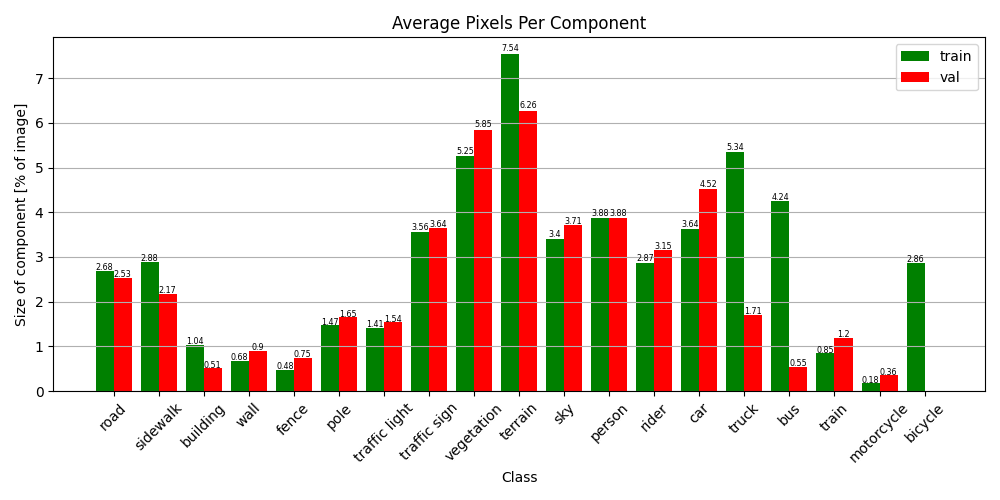
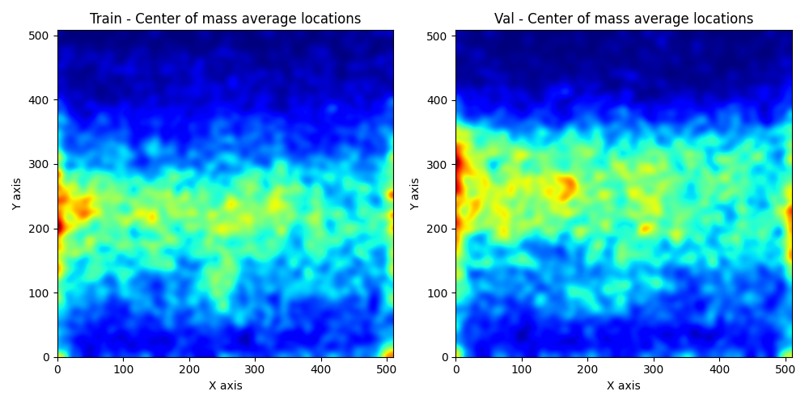
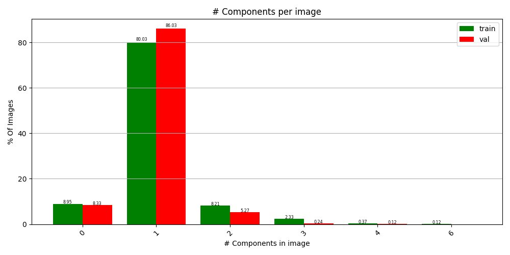

# Data Gradients
## What is this?
A Python-based repository that extracts meta data from your data loaders and visualizes it.
#### The benefits of Data Gradients
With Data Gradients, you can analyze your data in order to gain valuable insights.
1. Data validation: detecting corruption, ensuring diversity, and more.
2. Metadata extraction for maximizing the customized results for your architecture search

#### What does the data analyzer tool extract?
Statistics and metadata describe your data: histograms, heat maps, etc.

#### What doesn’t the data analyzer tool extract?
Images, labels, annotations, and locations of each object.
In addition, you can censor any classes you want, hide class names, and remove features you don’t want the tool to extract.

#### What does the tool output?
The tool extracts statistics and metadata into a TB file and a corresponding TXT file. The metadata and statistics in both files are the same.

#### What is a MUST-HAVE in order to use the tool?

* Train set data-loader that compatible to the available input types: Fill in the types
* Number of valid classes (in the binary case, the number of classes will be 1 while 0 will be ignored)

#### What is Optional in order to use the tool?

* Validation set data-loader that compatible to the available input types
* Class ID-to-name mapping (in a form of a dictionary)
* Number of samples to visualize (will output only on Tensorboard, can pass 0 if you prefer not to visualize)

<br>


<details>
    <summary> Available input types     </summary>


### Iterables
Python iterables objects implement the `next()` method for getting next object from iterator.
<br>
Can be ``torch.dataloader``, but not must.

### Images & Labels Objects
We support various of types for handling images or labels:
* `torch.Tensor`
* `numpy.ndarray`
* `PIL.Image`
* `Python Dictionary` (See [Python Dictionary Handling](#Python dictionary handling]))

<br>
<pre>
<details>
<summary>My dataset returns dictionary</summary>

```python
def __getitem__(...):
    return {'my_images': images: torch.Tensor,
            'my_labels': labels: numpy.ndarray,
            'my_extras': extras: List[str]
            }
```
OR
```python
def __getitem__(...):
    return images: torch.Tensor, {'my_labels': labels, 'my_other_labels': other_labels, 'labels_paths': labels_paths}
```
OR
```python
def __getitem__(...):
    return {'bgr_images': bgr_images, 'grayscale_images': grayscale_images}, labels: torch.Tensor
```
#### Python dictionary handling
As for the python dictionary, because of the various ways of getting
an item out of it, we will activate an interactive small utility
for extracting the right object out of the dictionary. This tool will map all the 
objects that this dictionary holds, and will ask you to choose which one is
the right one, either for "images" or for "labels".

Example:
```yaml
{
     all_labels: {
          not_good_torch_labels: Tensor ⓪,
          not_good_np_labels: ndarray ①,
          good_torch_labels: Tensor ②
     },
     something_other_then_labels: ndarray ③
}

prompt >> which one of the yellow items is your required data?
user input >> 2
```

</details>
</pre>
<br>
<pre>
<details>
<summary> My dataset returns a tuple</summary>

```python
def __getitem__(...):
    return images, labels
```
</details>
</pre>
<br>
<pre>
<details>

<summary> My dataset requires custom support </summary>

In that case, you can pass the manager a Callable (lambda or function), which handles images and labels separately.

```python
def images_extractor(x):
    x = x['images']['bgr_images']
    x /= 255.
    return x

labels_extractor = lambda x: (x['labels']['masks'] / 255.)

da = SegmentationAnalysisManager(
    train_data=train_loader,
    val_data=val_loader,
    images_extractor=images_extractor,
    labels_extarctor=labels_extractor)
```
</details>
</pre>

<br>


</details>

<br>
<details>
<summary>
Our point of view on augmentations
</summary>
<br>
There are different benefits to using this tool with or without data augmentations.
Using augmented data will allow us to see the model’s point of view of the data, which will be more realistic when finding problems with the training data.
Raw data, on the other hand, could provide stronger validation for data aggregation, labeling, and diversity.
There are advantages to both options, but as this tool is designed to optimize and customize the architecture for your data, we need to see what the model will see during training.

</details>

<br>
<details>
    <summary>How to use</summary>


### 1. Install data-gradients

```bash
pip install data_gradients-X.Y.Z-py3-none-any.whl
```
### 2. Run analysis manager

```python
from data_gradients.managers.segmentation_manager import SegmentationAnalysisManager

# Create torch DataLoader
train_loader = YourDataLoader(train_dataset, batch_size=batch_size)
val_loader = YourDataLoader(val_dataset, batch_size=batch_size)

da = SegmentationAnalysisManager(train_data=train_loader,
                                 val_data=val_loader,
                                 num_classes=num_classes)

da.run()


```
### 3. After progress is finished, view results through tensorboard

```bash
tensorboard --logdir=logs --bind_all
```
Click on link and view results:

``TensorBoard 2.11.0 at http://localhost:6007/ (Press CTRL+C to quit)``

</details>
<br>

<details>
<summary>
Output Example
</summary>







</details>


## Requirements

### PDF Export

In order to allow PDF export, you must install additional 3rd-party software `wkhtmltopdf`:

MacOS: `brew install Caskroom/cask/wkhtmltopdf`
Debian/Ubuntu: `apt-get install wkhtmltopdf`
Windows: `choco install wkhtmltopdf`
